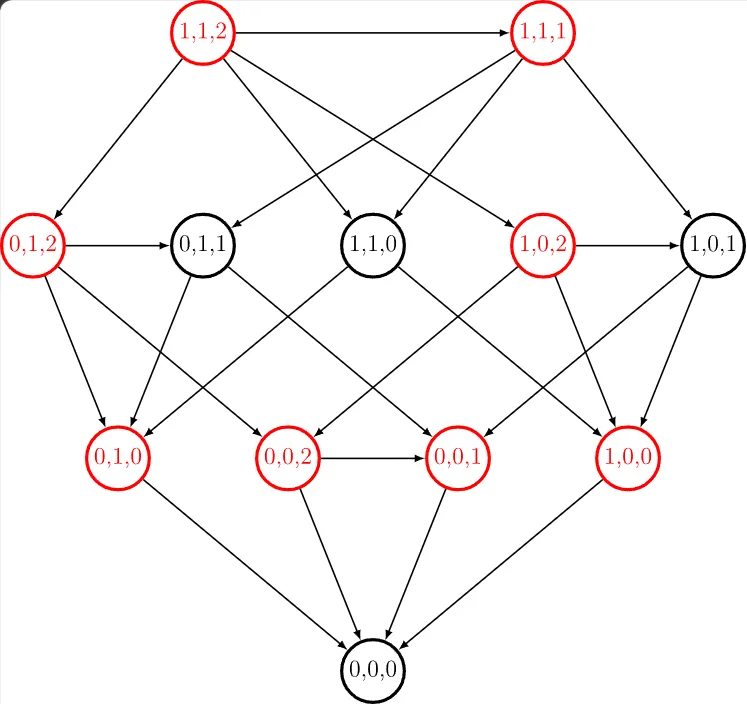

#博弈论 ^2a49f5
# 组合博弈论
## 公平组合游戏（ICG）
首先对于公平组合游戏必定满足以下几条结论：

1. 游戏由两名玩家轮流操作，双方信息完全公开，无任何随机因素。
2. 对任意一个游戏局面，双方可执行的合法操作完全一致（无阵营 / 棋子专属限制，象棋、围棋等有偏博弈不在此列）。
3. 游戏必然在有限步内结束，无法执行合法操作的玩家判负（即 Normal Play 正常规则，反常的 misère 规则需额外修正，不可直接套用）。

任何的ICG游戏都可以抽象为**有向无环图游戏**：把每个游戏局面看成一个顶点，每个合法操作对应一条从从当前局面指向后继局面的有向边，游戏过程就是玩家轮流沿着有向边移动，无法移动者判负。

最经典的ICG游戏为Nim游戏
### Nim游戏

可以发现Nim游戏满足ICG游戏的条件。我们就可以用有向无环图的形式表现出来Nim游戏。

> [!note]- Nim游戏
> 共有 $n$ 堆石子，第 $i$ 堆有 $a_i$ 石子，两名玩家轮流取走任意一堆中的任意枚石子。取走最后一枚石子的玩家获胜。 可以发现Nim游戏满足ICG游戏的条件。我们就可以用有向无环图的形式表现出来Nim游戏。
^8e28ce

例如，对于初始$3$堆石子的游戏，每堆石子的数量分别是1,1,2的Nim游戏，可以绘制如下的博弈图： 



红色状态为必定胜利的状态，黑色状态为必定失败的状态。这时候就不得不提到。

在公平组合游戏的条件中写道，游戏必定在<span style="color:red;font-weight:bold;">有限步数内结束</span>，所以对于ICG，开始的时候就已经决定了胜利者的一方（在玩家足够聪明的情况下）。所以Nim游戏的输赢只取决于游戏当前的状态，而与玩家的身份无关（区别于象棋的红黑方）。所以我们将Nim游戏中的每个状态设为**必胜态（N态）** 和**必败态（P态）：**

+ **必败态（P-position，$\mathcal P$ 态）**：也叫后手必胜态。处于该局面的玩家，无论怎么操作，都会把局面变成对手的必胜态，最终必败。
+ **必胜态（N-position，$\mathcal N$ 态）**：也叫先手必胜态。处于该局面的玩家，存在至少一种操作，能把局面变成对手的必败态，最终必胜。

归纳总结上面的必胜态和必败态，我们可以发现如下规律，也是公平组合游戏中的引理： ^273755
1. 没有后继的状态必定为**必败态$\mathcal P$**。
2. 一个状态为**必胜态$\mathcal N$** 当且仅当存在至少一个后继状态为**必败态$\mathcal P$** 。
3. 一个状态为**必败态$\mathcal P$** 当且仅当它的所有后继状态为 **必胜态$\mathcal N$** 。

> [!tip]- 证明
> 对于第一条，如果玩家当前已经没有可选的行动，那么玩家已经输掉了游戏．
> 
> 对于第二条，如果该状态至少有一个后继状态为必败状态，那么玩家可以操作到该必败状态；此时，对手面临了先手必败状态，玩家自己就获得了胜利．
> 
> 对于第三条，如果不存在一个后继状态为必败状态，那么无论如何，玩家只能操作到必胜状态；此时，对手面临了先手必胜状态，玩家自己就输掉了游戏．

所以对于我们的$Nim$ 游戏，我们在开始的时候就可以确定谁胜谁负，如果去绘制如上博弈图的话复杂度过高，所以我们需要总结结论。于是我们对于某个状态的谁胜谁负由$Nim$和决定，$Nim$和定义为如下
> 对于自然数$a_1,a_2,a_3 \dots a_n$的$Nim$和为$a_1 \oplus a_2 \oplus a_3 \oplus \dots \oplus a_n$ 。
> $Nim$游戏中，状态$(a_1,a_2,a_3 \dots a_n)$为**必败态$\mathcal P$** ，当且仅当其$Nim$和为
> $$a_1 \oplus a_2 \oplus a_3 \oplus \dots \oplus a_n = 0$$

以下证明来源于OIWiki，我还不理解其实
> [!tip]- 证明
> 对所有可能的状态应用归纳法：
>> 1.  如果$a_i = 0$对所有都成立，该状态没有后继状态，且 $Nim$ 和等于 0，命题成立．
>> 2. 如果$k = a_1 \oplus a_2 \oplus \dots \oplus a_n \ne 0$，那么，需要证明该状态为必胜状态。也就是说，需要构造一个合法移动，使得后继状态为必败状态；由归纳假设，只需要证明后继状态满足$a^{'}_1 \oplus a^{'}_2 \oplus a^{'}_3 \oplus \dots \oplus a^{'}_n = 0$。利用$Nim$和（即异或）的性质，这等价于说，存在一堆石子，将$a_i$拿走若干颗石子，可以得到$a_i \oplus k$，亦即$a_i > a_i \oplus k$。实际上，设$k$的二进制表示中，最高位的$1$是第$d$位。那么，一定存在某个$a_i$，使得它的二进制第$d$位是$1$。对于相应的石子堆，就一定有$a_i > a_i \oplus k$，因为$a_i \oplus k$中第$d$位为$0$，更高位和$a_i$一样。
>> 3. 如果$a_1 \oplus a_2 \oplus a_3 \oplus \dots \oplus a_n = 0$，那么，需要证明该状态时必败状态。由归纳假设可知，只要证明它的所有后继状态的$Nim$和都不是$0$。这是必然的，任何合法移动将$a_i$变为$a^{'}_i \ne a_i$，就必然会使得$Nim$和变为$a^{'}_i \oplus a_i \ne 0$。

### Sprague–Grundy 理论
简称$SG$理论。这一理论指出：所有公平组合游戏都等价于单堆 $Nim$ 游戏

而我们的单堆 $Nim$ 其实就相当于说$n$堆石子中的一堆，而我们上面的那道题[Nim游戏](博弈论#^8e28ce )
实际上就是由多个单堆$Nim$游戏组成的，也就是说是由多个相互独立的子游戏组成的。此时，游戏的状态判定可以通过计算子游戏的 $SG$ 函数值的 $Nim$ 和来完成．如果游戏本身没有这样的结构，那么，判定必胜状态和必败状态只需要应用前文博弈图一节的[引理](#^273755)。

那么其实我们就可以通过SG函数来求出某个状态SG值从而判断某个状态是否为必胜必败态。至于为啥，我也不知道，去看[公平组合游戏 - OI Wiki](https://oi-wiki.org/math/game-theory/impartial-game/#spraguegrundy-%E7%90%86%E8%AE%BA)这个，因为我也不会证明😂
那么对于某个状态的是SG值该如何去算呢：用SG函数去算，SG函数是啥呢

> 公平游戏$G$中的一个状态$x$对应的Sprague–Grundy函数值$SG(x)$满足$$SG(x) = mex\{SG(x^{'}) : x^{'} \in x\}$$
> 其中，$mex(A):=min\{n \in N : n \notin A\}$ 是没有出现在集合$A$中的最小自然数（仅仅是$mex$的定义而已）

说人话就是，一个状态的SG函数值为它所有后继状态的SG函数值的$mex$值。然后对于某个状态我们就可以通过SG函数值来判断是否为先手必胜状态

> 公平游戏$G$中的一个状态$x$是先手必胜状态，当且仅当$SG(x) \ne 0$ .

最后，对于我们这一整个$Nim$游戏的$SG$函数值的计算方法为

> 对于公平游戏$G_1,G_2,G_3,\dots G_n$，有$$SG(G_1,G_2,G_3,\dots G_n) = SG(G_1) \oplus SG(G_2) \oplus SG(G_3) \oplus \dots \oplus SG(G_n)$$

我们也可以通过是否为$0$判断是否先手必胜。

练习
[P4018 Roy&October之取石子 - 洛谷](https://www.luogu.com.cn/problem/P4018)
```cpp
#include <bits/stdc++.h>
#define int long long
#define ull unsigned long long
#define i128 __int128_t
using namespace std;
const int INF = 1e18;
const int N = 1e6 + 5;
const int MOD = 1e9 + 7;
void solve() {
	int n;
	cin>>n;
	if (n % 6) cout<<"October wins!\n";
	else cout<<"Roy wins!\n";
}
signed main() {
	ios::sync_with_stdio(false);
	cin.tie(0);
	cout.tie(0);
	cout << fixed << setprecision(15);
	int t = 1;
	cin >> t;
	while (t--) {
		solve();
	}
	return 0;
}
```
[P4860 Roy&October之取石子II - 洛谷](https://www.luogu.com.cn/problem/P4860)
```cpp
#include <bits/stdc++.h>
#define int long long
#define ull unsigned long long
#define i128 __int128_t
using namespace std;
const int INF = 1e18;
const int N = 1e6 + 5;
const int MOD = 1e9 + 7;
void solve() {
	int n;
	cin>>n;
	if (n % 4) cout<<"October wins!\n";
	else cout<<"Roy wins!\n";
}
signed main() {
	ios::sync_with_stdio(false);
	cin.tie(0);
	cout.tie(0);
	cout << fixed << setprecision(15);
	int t = 1;
	cin >> t;
	while (t--) {
		solve();
	}
	return 0;
}
```
[P10501 Cutting Game - 洛谷](https://www.luogu.com.cn/problem/P10501)
```cpp
#include <bits/stdc++.h>
#define int long long
#define ull unsigned long long
#define i128 __int128_t
using namespace std;
const int INF = 1e18;
const int N = 205;
const int MOD = 1e9 + 7;
int sg[N][N];
int dfs(int n,int m) {
	if (sg[n][m] != -1) return sg[n][m];
	int cnt = 0;
	set<int> s;
	for (int i=2;i<n-1;++i) s.insert(dfs(i,m) ^ dfs(n - i,m));
	for (int i=2;i<m-1;++i) s.insert(dfs(n,i) ^ dfs(n,m-i));
	for (const int&i : s) {
		if (i == cnt) ++cnt;
		else break;
	}
	return sg[n][m] = cnt;
}
signed main() {
	ios::sync_with_stdio(false);
	cin.tie(0);
	cout.tie(0);
	cout << fixed << setprecision(15);
	memset(sg,-1,sizeof(sg));
	for (int i=1;i<N;++i) sg[i][1] = sg[1][i] = 1;
	int n,m;
	while(cin>>n>>m) {
		if (dfs(n,m)) cout<<"WIN\n";
		else cout<<"LOSE\n";
	}
	return 0;
}
```
这里要补充一句，对于最后一道题来说，我们在遍历所有状态计算其SG函数值的时候使用了$mex$和$\oplus$ 两种，这两种运算其实不难区分。
可以这么理解：
> 一种状态的SG函数值取决于其所有后继状态的SG函数值的$mex$
> 我们的某个操作会将状态一分为多的时候，那么接下来是选择被分出来的不同的状态来进行下一步操作，显然是选择不同的有向图游戏，这个时候就要用$\oplus$

