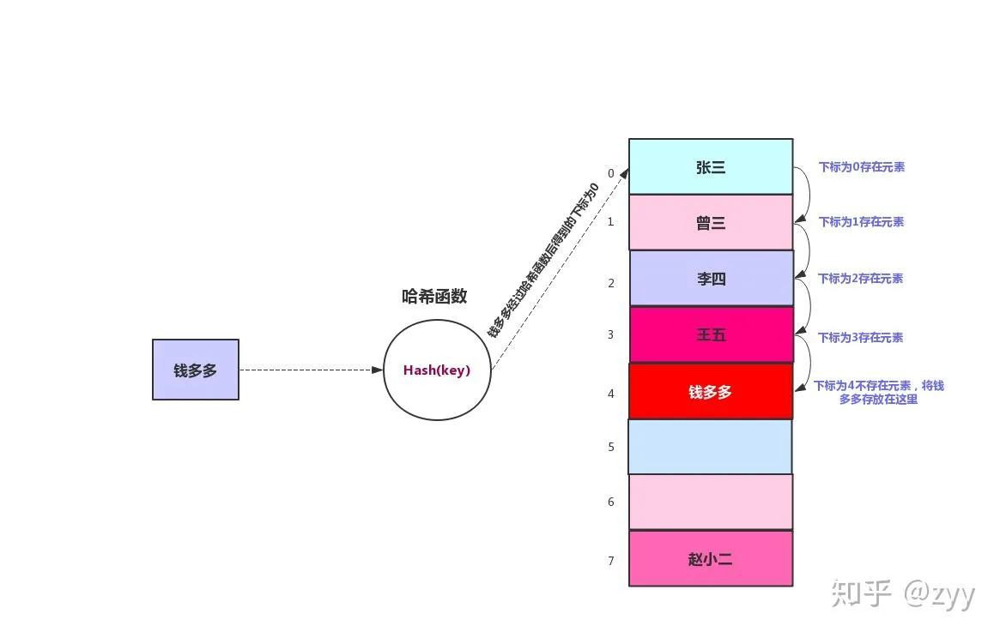
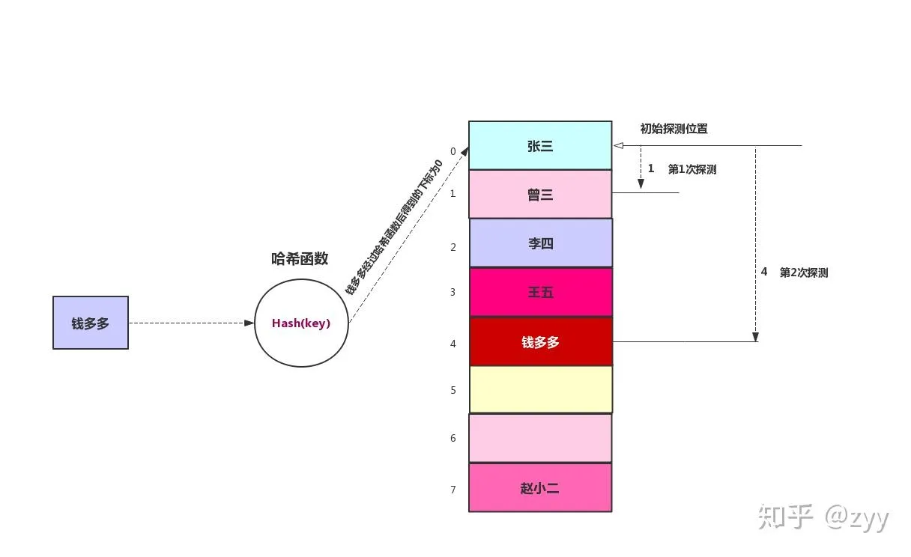
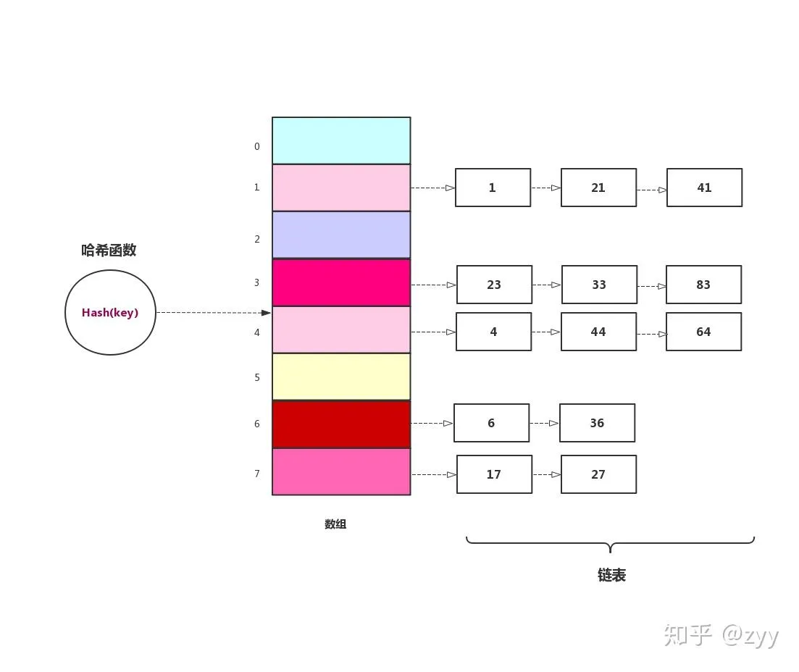

#哈希
哈希表其实理解起来比较简单，本质上就是通过一个函数算法将我们需要存储的数据转化为一个唯一的值作为index索引地址来进行存储。
哈希表在查找方面的效率非常块，所以也可以用来简单存储一系列键值对应的数据对。
我们将传入数据$key$转化为索引$index$%的函数称为哈希函数。

$${\Large index = H(key)}$$

所以其实哈希表的重点就是两个

+ 键、值一一对应（指的是我们可以通过给定的健来唯一查找到对应的值）
+ 哈希值唯一（通过哈希函数我们能算出来的哈希值唯一）

# 哈希函数
最简单的哈希表其实是一个桶(Bucket)，仅仅用一个数组来表示哈希表，通过对应的`key`找到对应桶中的`value`，从`key`到数组中桶索引的映射就是哈希函数的作用。

哈希函数有几个要求：

+ 计算效率高，从`key`到`index`的计算速度要高
+ 避免冲突，当有不同`key`定位到相同的`index`时，我们要尝试重新设计哈希函数，避免哈希冲突

而哈希函数通常有以下几种简单的计算方法：

## 直接定址法
哈希函数为`key`的线性表达式如$H(key) = a * key + b$，这种的表达式。
但是这种哈希函数具有较大的局限性，它只能用来表示，部分封闭集合的关键字情况
比如：
假设需要统计中国人口的年龄分布，以10为最小单元。今年是2025年，那么10岁以内的分布在2015-2025，20岁以内的分布在2005-2015……假设2025代表2025-2015直接的数据，那么关键字应该是2025，2015，2005……

表格如下：

| index | key  |  年龄   | 人数（假设数据） |
| :---: | :--: | :---: | :------: |
|   0   | 2025 | 0-10  |   200W   |
|   1   | 2015 | 10-20 |   250W   |
|   2   | 2005 | 20-30 |   253W   |
|   3   | 1995 | 30-40 |   250W   |
|  ……   |      |       |          |

## 取余法
这种方法一般情况下的用的比较多，也比较简单

$H(key) = key\mod p$(p为表长)

这种哈希方法最简单，但是也最容易冲突。比如p为7的时候，插入的0和21两个值就冲突了。

### 其他的哈希函数
SHA-2、murmurhash、DJB2 hash等等

# 哈希冲突
上面提到，我们的哈希函数的作用是通过一个函数将`key`值和`index`进行对应，而这个index则是我们存储数据在数组中的索引，当我们不使用数组进行存储哈希表时，那么哈希函数就是为了唯一的于`value`的值进行，对应，要求是一个`value`值只能有**唯一**的`key`对应，但是没有一个哈希函数能做到这么完美，总会有几个`key`对应到一个`value`，这时就产生了哈希冲突。

如何解决哈希冲突呢。

我们有一个东西用来衡量哈希冲突的可能，叫做负载因子，计算方法为：总键值对数/容量，一般来说建议负载因子维持再0.75以内，如果大于0.75了那么建议哈希表扩容。

## 开放地址法
开放地址通常有三种解决方案

+ 线性探测
+ 二次探测
+ 二次哈希

### 线性探测
在构建哈希表时，取一个随机值d，这个d为位移值，代表哈希冲突时进行的位移。

例如，当我们需要插入23这个值时，使用哈希函数后发现对应的`index`已经有数据了，那么就再往数组后移d位，如果依旧冲突再移d位，直到空了位置，通常我们的d值要求不能为p公约数或者公倍数，否则就会陷入循环。

比如：

上图中，当我们插入“钱多多”时，通过哈希函数算出来索引为0，但是冲突了，就往0后移d位（这里的d = 1），还是冲突就再移d值，直到不冲突。

线性探测为了避免哈希冲突，牺牲了效率，因为我们查找的时候需要一个个d来查找，查找效率特定情况下会很低。

### 二次探测
在线性探测哈希表中，数据会发生聚集，一旦聚集形成，它就会变的越来越大，那些哈希函数后落在聚集范围内的数据项，都需要一步一步往后移动，并且插入到聚集的后面，因此聚集变的越大，聚集增长的越快。这个就像我们在逛超市一样，当某个地方人很多时，人只会越来越多，大家都只是想知道这里在干什么。

二次探测是防止聚集产生的一种尝试，思想是探测相隔较远的单元，而不是和原始位置相邻的单元。在线性探测中，如果哈希函数得到的原始下标是x,线性探测就是$x+d,x+2*d,x+3*d$......，以此类推，而在二次探测中，探测过程是$x+d,x+(2*d)^{2},x+(3*d)^{3},x+(4*d)^{4}$......,以此类推，到原始距离的步数平方，为了方便理解，我们来看下面这张图

还是使用线性探测中的例子，在线性探测中，我们从原始探测位置每次往后推一位，最后找到空位置，在线性探测中我们找到`钱多多`的存储位置需要经过4步。在二次探测中，每次是原始距离步数的平方，所以我们只需要两次就找到`钱多多`的存储位置。

### 二次哈希
二次哈希简单来说就是对哈希出来的值再设计一个哈希函数进行哈希运算。

这个比较好理解，就不讲了

## 链式寻址法
相比于开放地址法，链式寻址法的需要的空间更大，因为对于每个空间来说都存储一个链表，如图所示。

也比较简单，不多讲了。

